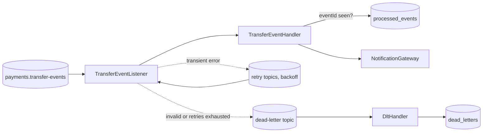

# Transfer Events Consumer

A Spring Boot Kafka consumer that reads `TransferCompleted` events from the [payment-transaction-service](https://github.com/deekshita21/payment-transaction-service) and sends a customer notification exactly once from the customer's point of view, even though Kafka delivers messages at least once.

> **Portfolio project.** I wrote this independently with synthetic data to show event-driven design practices. It does not contain code, data, or architecture from any employer or client.


## Problems it handles

| Failure | Behavior |
|---|---|
| Same event delivered twice (rebalance, producer retry, outbox re-send) | `processed_events` table keyed by `eventId`; duplicates are skipped. |
| Notification provider times out | Non-blocking retries through retry topics with exponential backoff. The main partition keeps flowing. |
| Provider stays down | After the configured attempts the message goes to the dead-letter topic and is stored in `dead_letters` for review and replay. |
| Bad message (invalid JSON, missing fields) | Classified as non-retryable and sent straight to the dead-letter topic. |

## Flow



## Tech stack

Java 21 · Spring Boot 3.5 · Spring Kafka (`@RetryableTopic`, `@DltHandler`) · Spring Data JPA · Flyway · PostgreSQL · JUnit 5 · Mockito · Embedded Kafka · Awaitility · GitHub Actions

## Configuration

| Property | Default | Meaning |
|---|---|---|
| `app.topic` | `payments.transfer-events` | Source topic |
| `app.retry.attempts` | `4` | Total delivery attempts before dead-lettering |
| `app.retry.initial-delay-ms` | `1000` | First backoff |
| `app.retry.multiplier` | `2.0` | Backoff multiplier |
| `app.retry.max-delay-ms` | `30000` | Backoff cap |

Database and broker come from `DB_URL`, `DB_USERNAME`, `DB_PASSWORD`, `KAFKA_BOOTSTRAP_SERVERS`. Nothing secret is stored in the repository.

## Run

```bash
# with the payment service's docker compose stack running (Kafka on localhost:9092)
export DB_URL=jdbc:postgresql://localhost:5432/payments DB_USERNAME=payments DB_PASSWORD=<local password>
mvn spring-boot:run
```

## Tests

```bash
mvn verify
```

`TransferEventListenerIntegrationTest` runs against an embedded Kafka broker and covers: single processing, duplicate delivery, transient failure then success, invalid payload to DLT, and retries exhausted to DLT. `TransferEventHandlerTest` covers validation and duplicate detection without Kafka.

## Design notes and limits

- The notification is sent before the `processed_events` row commits. If the process dies between the two, the event is re-delivered and the customer could get a second message. Closing that gap fully needs an idempotency key supported by the provider; the gateway interface is where it would go.
- Logs contain ids and amounts only, no names or contact details.
- Next steps: replay endpoint for dead letters, consumer lag metrics and alerts, schema registry (Avro) for the event contract.

## License

MIT
